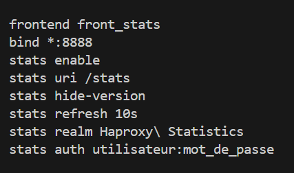
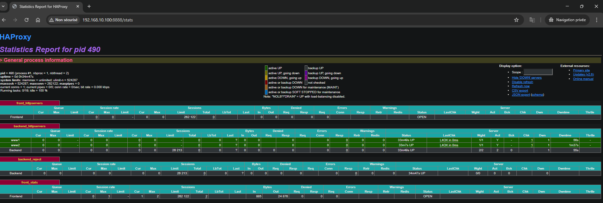
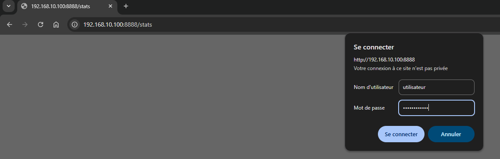
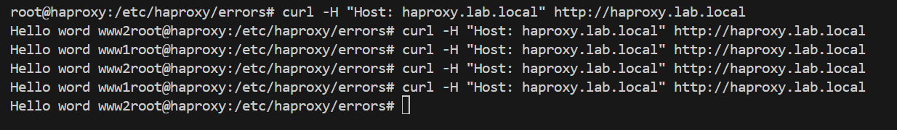
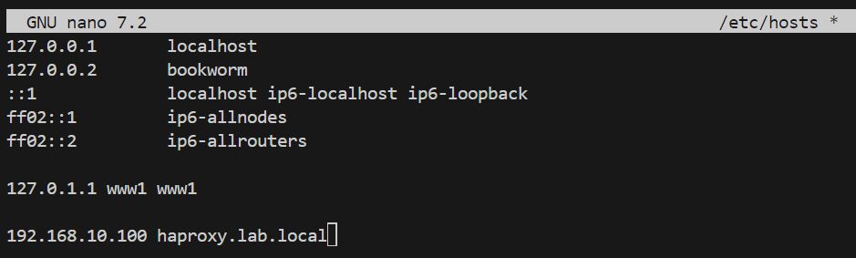
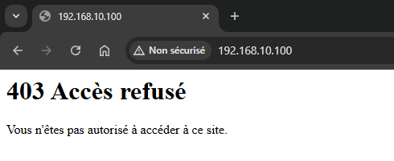

# Configuration de HAProxy

Ce document décrit l'installation, la configuration, la sécurisation et les tests réalisés autour du reverse proxy **HAProxy** dans le cadre du projet Vagrant + Ansible.


## 🎯 Objectif

Mettre en place un load balancer avec HAProxy qui :

* Répartit les requêtes HTTP entre deux serveurs web (www1 et www2) via la méthode **round-robin**.
* Protège l'accès aux applications via des règles ACL (liste de contrôle d'accès).
* Fournit une page de **statistiques sécurisée** pour la supervision.
* Affiche une page **403 personnalisée** en cas d'accès non autorisé.


## 🔧 Installation d’HAProxy

L'installation est réalisée automatiquement via Ansible (`provision.yml`) sur la VM `haproxy`. Elle comprend les étapes suivantes :

```bash
sudo apt update && sudo apt upgrade -y
sudo apt install -y haproxy
```


## 📁 Fichier de configuration

Le fichier principal est :

```bash
/etc/haproxy/haproxy.cfg
```

Ce fichier contient toute la configuration (frontend, backend, règles ACL...).

> 💡 **Conseil :** Faire une sauvegarde du fichier avant modification.

```bash
copy:
  src: /etc/haproxy/haproxy.cfg
  dest: /etc/haproxy/haproxy.cfg.bak
```


## 🔜 Page de statistiques

HAProxy propose une interface de supervision, elle permet d'avoir une vue d'ensemble sur mon infrastructure :


* Configuration de la partie frant_stats dans le fichier du configuration du HAProxy :  




> **URL :** [http://192.168.10.100:8888/stats](http://192.168.10.100:8888/stats)



### 🔐 Authentification

* **Utilisateur :** `utilisateur`
* **Mot de passe :** `mot_de_passe`




## ⚠️ Règles ACL (contrôle d'accès)

Les requêtes sans le bon `host` (`haproxy.lab.local`) sont redirigées vers un backend spécifique `backend_reject` qui renvoie une page `403`.

Exemple d'utilisation d'ACL :

```haproxy
acl ACL_app hdr(host) -i haproxy.lab.local
use_backend backend_httpservers if ACL_app
```




## 📙 DNS / Fichier hosts

Pour que les ACL fonctionnent, pensez à ajouter le domaine au fichier `/etc/hosts` sur les clients ou navigateurs de test :

```bash
192.168.10.100 haproxy.lab.local
```




## ❌ Page 403 personnalisée

Fichier personnalisé : `/etc/haproxy/errors/403.http`

Exemple :

```
http
HTTP/1.0 403 Forbidden
Cache-Control: no-cache
Connection: close
Content-Type: text/html

<html><body><h1>403 Forbidden</h1>
Vous n'avez pas accès à cette ressource.
</body></html>
```




## 🧪 Tests de fonctionnement

| Test               | Commande                                                  | Résultat attendu         |
| ------------------ | --------------------------------------------------------- | ------------------------ |
| Accès via bon host | `curl -H "Host: haproxy.lab.local" http://192.168.10.100` | Réponse des serveurs web |
| Accès via IP seule | `curl http://192.168.10.100`                              | Erreur 403 personnalisée |
| Page de stats      | `curl http://192.168.10.100:8888/stats`                   | Authentification requise |


## ✅ Configuration HAProxy finale

```haproxy
global
    log /dev/log local0
    log /dev/log local1 notice
    daemon
    maxconn 2048

defaults
    log     global
    mode    http
    option  httplog
    option  dontlognull
    timeout connect 10s
    timeout client 10s
    timeout server 10s
    errorfile 403 /etc/haproxy/errors/403.http

frontend front_httpservers
    bind *:80
    mode http
    option forwardfor
    acl ACL_app hdr(host) -i haproxy.lab.local
    use_backend backend_httpservers if ACL_app
    default_backend backend_reject

backend backend_httpservers
    mode http
    balance roundrobin
    option httpchk
    server www1 192.168.10.111:80 check
    server www2 192.168.10.112:80 check

backend backend_reject
    mode http
    errorfile 403 /etc/haproxy/errors/403.http

frontend front_stats
    bind *:8888
    mode http
    stats enable
    stats uri /stats
    stats hide-version
    stats refresh 10s
    stats realm Haproxy\ Statistics
    stats auth utilisateur:mot_de_passe
```


## 🚀 Conclusion

Ce que j'ai au final : 

* d'un reverse proxy fonctionnel et sécurisé,
* d'une interface de stats pour la supervision,
* d'une architecture entièrement automatisée avec Vagrant + Ansible + HAProxy.


## 📁 À voir aussi

* [`docs/vagrant.md`](./docs/vagrant.md) : Création et provisionnement des VMs
* [`docs/ansible.md`](./docs/ansible.md) : Automatisation avec Ansible
* [`docs/commandes_vagrant.md`](./docs/commandes_vagrant.md) : Rappels de commandes utiles
